# AI_generative_glitches

ComfyUI nodes that glitch a diffusion model from the inside. `Glitch Model (Krea2)` damages the model's
internal activations while it generates, in a controlled and repeatable way, so you can see how the
picture changes. It never modifies a checkpoint file or the model weights: remove the node and the model
is back to normal.

Works with **Krea2** models, loaded from GGUF or safetensors — the nodes check the model architecture,
not the file format. Other architectures are rejected with a clear message; support for more (Flux is the
closest fit) is a small addition if there is interest.

## Install

Clone or link this repository into ComfyUI's `custom_nodes`, then restart ComfyUI:

```bash
git clone https://github.com/wasawi/AI_generative_glitches.git /path/to/ComfyUI/custom_nodes/AI_generative_glitches
```

The nodes appear under **experimental → glitches**. Edits take effect after a restart.

Two nodes are included: `Glitch Model (Krea2)` (the glitch itself) and `Glitch Shape (Krea2)` (optional
control over noise type, spatial masks and strength curves). Workflows saved before the project was
renamed still load: the previous node names remain registered, hidden from the search.

## Wiring

```
GGUF Loader / Unet Loader (GGUF) / Load Diffusion Model → Glitch Model (Krea2) → KSampler → VAE Decode → Save Image
```

`GGUF Loader` (`LoaderGGUF`, from the `gguf` custom-node pack) and `Unet Loader (GGUF)` (from ComfyUI-GGUF) are
alternatives for loading a Krea2 GGUF checkpoint; `Load Diffusion Model` is the core loader for safetensors.

Works with any Krea2 model (GGUF or safetensors). Other architectures are rejected with a clear error.
The `recipe` output is a one-line summary of the settings; connect it to `Preview Any` or save it with
your image metadata.

## Controls

| Input | Meaning |
|---|---|
| `enabled` | Off = unmodified model |
| `mode` | `dropout`, `amplify`, `sign_flip` or `noise` (below) |
| `strength` | Dose. Any finite value, negative included: a negative dose runs the formula backwards (negative `dropout` amplifies, negative `amplify` attenuates and inverts). 0 is always no change |
| `probability` | Fraction of the 6144 hidden channels hit at each site (at least one when > 0, so 0.0002 ≈ a single channel). Step 0.0001 |
| `target` | Glitch the output of `attention`, `mlp` or `both` in each block |
| `block_start`, `block_end` | Which of the 28 main blocks (0–27), inclusive. A value past the model's last block is clamped, never an error |
| `step_start`, `step_end` | Which sampling steps, inclusive; step 0 is the first step KSampler runs |
| `glitch_seed` | Picks the channels and the noise. Same seed + same settings = same glitch. Keep it fixed while comparing runs; change it deliberately to get a different glitch pattern. Any integer is accepted: a negative or oversized seed folds into range, never an error — which matters when the input is linked, since a link bypasses the widget's limits |

Only the image being generated is glitched. Prompt tokens, the text-fusion stage and reference images are
never touched, so the model still reads the prompt; it just draws it wrongly.

At each site and step, the same randomly chosen channels are hit for every image token. With strength `s`:

| Mode | Selected channels become | `strength` range |
|---|---|---|
| `dropout` | `x × (1 − s)` (1 = silenced, 2 = negated, 5 = −4x, −1 = doubled) | any finite |
| `amplify` | `x × (1 + s)` (−2 = inverted) | any finite |
| `sign_flip` | `x × (1 − 2s)` (0.5 = zeroed, 1 = negated, 1.5 = −2x, −1 = tripled) | any finite |
| `noise` | `x + s × rms × Gaussian noise`, where rms is the token's own activation size | any finite |

Steps: with 8 sampling steps, `step_start=0, step_end=3` glitches the first half, where composition is
decided; later steps mostly affect detail and texture. With `denoise < 1` or KSampler Advanced
`start_at_step`, step 0 is the first step actually run.

## First experiment

`workflows/krea2-glitch-smoke.json` (open it with **Workflow → Open**): fixed prompt and seed,
8 steps, glitch node set to `noise`, strength 0.5, probability 0.25, target both, blocks 0–27, steps 0–3.

1. Set the KSampler's *control after generate* to **fixed** if it shows `randomize`.
2. Run with `enabled` **off** → image A.
3. Run with `enabled` **on** → image B.
4. Run with `enabled` **off** → image C.
5. Run with `enabled` **on** → image D.

Alternate like this: ComfyUI caches results, so re-queuing identical settings returns the cached image
instead of generating again. Then compare (images are in ComfyUI's output folder under `glitchlab/`):

```bash
python tools/compare_images.py A.png C.png   # how much your setup varies run to run
python tools/compare_images.py B.png D.png   # the glitch repeats
python tools/compare_images.py A.png B.png   # the glitch's effect
```

A/C and B/D should be identical, or differ no more than A/C does (Apple GPU kernels are not always
bit-exact). A/B should differ clearly.

Things to try next: `dropout` strength 1 on `mlp` only; a narrow block range such as 10–14; only late
steps (5–7); compare `glitch_seed` 0, 1 and 2 at the same settings.

## Random exploration

`workflows/krea2-glitch-random.json` is the smoke workflow with every glitch input except `enabled` driven by
one random **master seed** (the `Glitch master seed` node, set to *randomize*). Every queue draws a new recipe
that is always valid:

| Input | Random range |
|---|---|
| `mode` | dropout, amplify, sign_flip, noise |
| `target` | attention, mlp, both |
| `strength` | signed: magnitude 0.05–2.0 for dropout and sign_flip, 0.05–4.0 for amplify and noise, either sign |
| `probability` | 0.05–1.0 |
| `block_start`, `block_end` | two draws in 0–27, lower one is the start |
| `step_start`, `step_end` | two draws in 0–7 (the 8 KSampler steps), lower one is the start |
| `glitch_seed` | the master seed itself |

How it works, with no custom code: three core `Math Expression` nodes mix the master seed (splitmix64), eight more
read separate bit fields of the result, and two `easy anythingIndexSwitch` nodes turn the mode and target indexes
into the combo values. It needs comfyui-easy-use (`easy seed`, `easy anythingIndexSwitch`).

- The KSampler seed stays **fixed**, so only the glitch changes between runs. The `Recipe` preview shows what was drawn.
- To repeat a result, set `Glitch master seed` to **fixed** and enter that seed. The seed is also stored in the
  workflow embedded in each saved PNG.
- To change a range, edit the expression in the matching node: `2.0` and `1.0` in `strength`, `0.05` in
  `strength`/`probability`, `% 28` in the block nodes. The step nodes use `& 7` (0–7); for a different KSampler
  step count `N`, use `min(((a >> 46) & 255) % N, ((a >> 54) & 255) % N)` in `step_start` and the same with
  `max` in `step_end` — this also widens each field from 3 bits to 8, which is why the second shift moves
  from 49 to 54 (bits 46–53 and 54–61 are otherwise unused; do not use `(a >> 49) & 255`, since bits 49–56
  would overlap the first field and correlate the two draws).

## Shaping the glitch

`Glitch Shape (Krea2)` is an optional companion node. Connect its `shape` output to the glitch node's
`shape` input; without it the glitch node behaves exactly as described above.

| Input | Meaning |
|---|---|
| `distribution` | Noise values: `gaussian`, `uniform`, `laplace` (occasional large values), `cauchy` (rare huge spikes, clipped at ±20), `spikes` (most values 0, a few big ones), `binary` (±1). Noise mode only |
| `spike_density` | Fraction of values that spike with `spikes` |
| `noise_scale` | Noise blob size in image tokens (1 token = 16×16 px). 1 = fine grain … up to 64 = very large blobs; at the maximum, the coarse grid can collapse to a single cell (at 1024×1024, a 64×64 token grid, `noise_scale` 64 gives each channel one constant value across the whole image — a per-channel offset rather than noise). Noise mode only |
| `step_curve` | Strength multiplier across sampling steps (every mode) |
| `block_curve` | Strength multiplier across the 28 blocks (every mode) |
| `spatial_mask` | Strength multiplier over the picture (every mode): white = full glitch, black = untouched |

At `noise_scale` 1 every distribution except `cauchy` has the same average size, so `strength` means the
same across them. At `noise_scale` above 1 the field is rescaled per channel, which brings `cauchy` to
that size too; with `spikes` and a large blob size on a small image, some channels can come out empty and
add nothing.

**Curves.** Any node with a `FLOAT` value or list output works, for example KJNodes **Spline Editor**
(add it with a double-click search, then connect its `float` output). For one control point per sampling
step, set the Spline Editor's `points_to_sample` to your KSampler step count (8 in the example workflows)
and connect it to `step_curve`; for one control point per Krea2 block, set `points_to_sample` to 28 and
connect it to `block_curve`. A curve is always stretched over the whole run regardless of that count: its
first point is step 0 (or block 0), its last point the final step (or block 27), with straight lines in
between, whatever `points_to_sample` is — so any other length still works. Values above 1 boost the
glitch; negative values reverse it. KJNodes' Spline Editor defaults its own `min_value`/`max_value` to
0/1, so raise `max_value` above 1 to boost or lower `min_value` below 0 to reverse. The glitch node's
step and block windows still limit where it acts,
so open them fully (`step_start` 0, `step_end` 999, `block_start` 0, `block_end` 27) when you let a curve
do the shaping.

**Masks.** Any `MASK` works: ComfyUI's own `SAM3 Detect` (segment by text — see
[Masks from segmentation](#masks-from-segmentation)), KJNodes `CreateShapeMask`, `CreateGradientMask`,
`CreateVoronoiMask`, `CreateFluidMask`, or a mask painted with ComfyUI's mask editor on a `Load Image`
node. The mask is stretched to the image, so draw it at the image's aspect ratio. A mask with several
frames plays across the sampling steps (first frame at step 0, last frame at the final step).

The mask is a multiplier, not a switch: mid-grey is a half-strength glitch, and a blurred edge fades the
glitch out across that edge. Nothing is thresholded. It is also reduced to the image token grid — 64×64
tokens at 1024×1024, 104×78 at 1664×1248, one token being 16×16 px — so shapes two or three tokens across
survive and anything finer does not. A bicycle frame yes; its spokes no.

`workflows/krea2-glitch-shape.json` is a ready example: the smoke workflow with `noise` mode shaped by
`spikes` (density 0.05, blob size 4) inside a centred circle from `CreateShapeMask`. It needs
comfyui-kjnodes.

### Randomized version

`workflows/krea2-glitch-shape-random.json` is the same graph with one `Master seed` node (set to
*randomize*) driving **every** glitch, shape and mask input through `Math Expression` nodes and index
switches — the same splitmix64 mixer as the random workflow, extended with two further mixed values so
each setting reads its own bits. Unplug any randomizer to pin that input by hand; `enabled` and the
KSampler seed stay manual, and `step_curve`/`block_curve` stay free for a Spline Editor.

| Input | Random range |
|---|---|
| `mode`, `target` | all four modes / all three targets |
| `strength` | signed: magnitude 0.05–2.0 for dropout and sign_flip, 0.05–4.0 for amplify and noise, either sign |
| `probability` | 0.05–1.0 |
| blocks, steps | two draws each (0–27, 0–7), lower one is the start |
| `distribution` | all six |
| `spike_density` | 0.01–0.5 |
| `noise_scale` | 1–16 |
| mask `shape` | circle, square, triangle |
| mask `frames` | 1–8 (each frame is a full-size mask tensor, so this is deliberately far below the node's 4096) |
| mask canvas | 512, 768 or 1024 square |
| mask position and size | derived from the canvas, so the shape always stays on it (10–60 % of the canvas) |

## Masks from segmentation

`SAM3 Detect` turns a text phrase into a mask, so the glitch can follow a real shape instead of a circle
or a square. It is a core ComfyUI node — nothing to install beyond the checkpoint.

**The ordering problem.** SAM3 segments a finished picture, but the glitch runs *while* the picture is
being made, and the most interesting settings damage steps 0–2, when nothing recognisable exists yet. You
cannot mask the bicycle before the bicycle is drawn. There are two ways round it, one workflow each.

**Two passes, one picture** — `workflows/krea2-glitch-mask-sam3.json`. Pass 1 draws the picture
untouched, `SAM3 Detect` segments it, and pass 2 re-denoises **only the masked region**, starting from
pass 1's own latent.

Re-running the same seed is not enough, and this is worth understanding before you change the graph.
Glitching the early steps changes the composition decisions themselves, and since every block is
attention over all tokens, damage inside the mask reaches every other token on the very next block. A
second full generation therefore gives you a *different* subject, correctly masked — which is not what
anyone wants. `SetLatentNoiseMask` is what fixes it: at each step the sampler keeps the new result inside
the mask and restores pass 1's latent outside it, so everything outside the mask comes out identical
rather than merely similar.

Pass 2's `denoise` then decides how much of the subject survives inside the mask: around `0.4`–`0.6` it
is clearly the same object with damage, `0.75` (the default) leaves it recognisable but strongly
distorted, and `1.0` rebuilds the masked region from scratch. Note that `denoise` below 1 shortens the
run, and the glitch node counts steps actually sampled — at 8 steps and `denoise` 0.75 there are 6, so
`step_end` 2 covers the first three of those.

ComfyUI caches pass 1, so only the first queue pays for it; changing strength, mode, `glitch_seed` or
`denoise` afterwards re-runs the glitched pass alone. Look at the `Where the damage will land` overlay
before judging the output.

**A stencil from any picture** — `workflows/krea2-glitch-mask-stencil.json`. Segment a photo you already
have and use the silhouette as the shape of the damage: a glitch shaped like a cat, a face, a road sign.
No second pass, no ordering problem. The generated image has nothing to do with the reference; only the
outline is borrowed. The mask is stretched to the image, so a reference at your output's aspect ratio
keeps the silhouette undistorted.

**Conditioning the mask.** Both workflows put `GrowMaskWithBlur` between the segmenter and the glitch.
Grow by about 3 tokens and blur by about 2 — 48 px and 32 px at 1024×1024. The growth absorbs the drift
between the two passes; the blur turns the edge into a fade instead of a cliff, which is the whole point
of the mask being a multiplier. Do not threshold it.

**The model.** `sam3.1_multiplex_fp16.safetensors` (1.75 GB) goes in `ComfyUI/models/checkpoints/`, from
[Comfy-Org/sam3.1](https://huggingface.co/Comfy-Org/sam3.1/resolve/main/checkpoints/sam3.1_multiplex_fp16.safetensors).
It carries its own text encoder, so the `CLIPTextEncode` holding the object phrase takes its `CLIP` from
the SAM3 checkpoint, never from the Krea2 text encoder.

**Prompt syntax.** At most 32 tokens. Commas separate categories, and `:N` is how many objects of that
category to find — `bicycle:2, window:4` — *not* a weight. Parenthesised weights such as `(bicycle:1.2)`
are stripped, so do not use them.

**Leave `individual_masks` off.** Switched on it returns one mask per object, and a stack of masks is read
here as frames played across the sampling steps — so several objects would animate over the run instead of
glitching several regions.

**If your ComfyUI has no `SAM3 Detect`.** Only the mask source changes; the rest of either graph stays as
it is. Delete the three SAM3 nodes and connect any other `MASK` output to `GrowMaskWithBlur`:

| Alternative | Needs |
|---|---|
| `LayerMask: SegmentAnythingUltra V2` (comfyui_layerstyle) | text phrase; downloads SAM + GroundingDINO |
| `Apply CLIPSeg` (comfyui_essentials) | text phrase; downloads a small CLIPSeg model |
| `SAMLoader` + `SAMDetectorCombined` (comfyui-impact-pack) | points or boxes rather than text |

Both workflows need comfyui-kjnodes for `GrowMaskWithBlur` (and `ImageAndMaskPreview` in the two-pass
one). The randomized shape workflow deliberately keeps its procedural masks: a segmenter would load a
1.75 GB model on every queue, and its mask would no longer be a function of the master seed.

## Limits

- torch.compile is not supported: ComfyUI's compile wrapper swaps `diffusion_model` at call time regardless
  of node order, so putting this node before or after a torch.compile node does not help; results with
  torch.compile in the graph are undefined.
- Very high strengths can overflow models that run in float16 (black image or NaN errors); bfloat16 and
  float32 models have far more headroom.
- Single-frame image latents only (multi-frame T > 1 latents are rejected); single GPU only.
- The loaders' own limits still apply: ComfyUI-GGUF's `Unet Loader (GGUF)` rejects GGUF files tagged with
  arch `krea2` (for example `krea2_turbo_Q4_0.gguf`); the smoke workflow's `museByStableYogi_v25GGUF.gguf`
  loads with the `gguf` pack's `GGUF Loader`, which is what the user's own Krea2 workflow uses.

## Development

Tests run with the ComfyUI venv's Python; pytest lives in `./.test-deps` (git-ignored):

```bash
python -m pip install --no-cache-dir --target ./.test-deps pytest
PYTHONPATH=.test-deps PYTHONDONTWRITEBYTECODE=1 python -m pytest tests -v
```

Integration tests import ComfyUI read-only. They find it automatically (`$COMFYUI_ROOT`, a parent
directory when this package sits in `custom_nodes`, or a `ComfyUI` folder in your home directory) and
skip if none is found. One test reads the tensor names of a real Krea2 checkpoint and skips unless
`KREA2_GGUF` points at one:

```bash
COMFYUI_ROOT=/path/to/ComfyUI KREA2_GGUF=/path/to/krea2.gguf \
  PYTHONPATH=.test-deps PYTHONDONTWRITEBYTECODE=1 python -m pytest tests -v
```

The example workflows name the checkpoint, text encoder and VAE used while developing them; substitute
your own in the loader nodes. Design documents and implementation plans: `docs/superpowers/`.
Licence: MIT (see `LICENSE`).

## Gallery

Every picture here came from the two-pass masked workflow: one clean pass, `SAM3 Detect` finds the
subject, then the glitched pass repaints only that region. Newest first; within a group only the
glitch seed changes.

**`noise` · strength 100 · probability 0.0001 · `gaussian` blob 4 · steps 0–2**

_Probability 0.0001 rounds to a **single** channel out of 6,144 — one number in the model's description of each patch, hit 100× harder than it normally speaks._

<table>
<tr>
<td width="33%"><a href="docs/images/glitch-01.jpg"></a></td>
<td width="33%"><a href="docs/images/glitch-02.jpg"></a></td>
<td width="33%"><a href="docs/images/glitch-03.jpg">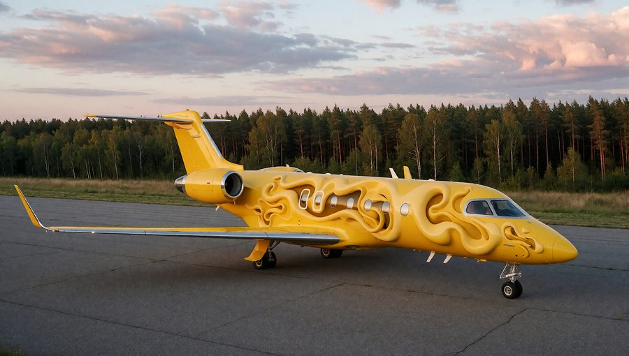</a></td>
</tr>
<tr>
<td width="33%"><a href="docs/images/glitch-04.jpg"></a></td>
<td width="33%"><a href="docs/images/glitch-05.jpg"></a></td>
<td width="33%"><a href="docs/images/glitch-06.jpg"></a></td>
</tr>
</table>

**`noise` · strength 100 · probability 0.0001 · `binary` blob 4 · steps 0–2**

_Probability 0.0001 rounds to a **single** channel out of 6,144 — one number in the model's description of each patch, hit 100× harder than it normally speaks._

<table>
<tr>
<td width="33%"><a href="docs/images/glitch-07.jpg"></a></td>
<td width="33%"><a href="docs/images/glitch-08.jpg"></a></td>
<td width="33%"><a href="docs/images/glitch-09.jpg"></a></td>
</tr>
<tr>
<td width="33%"><a href="docs/images/glitch-13.jpg"></a></td>
<td width="33%"><a href="docs/images/glitch-14.jpg"></a></td>
<td width="33%"><a href="docs/images/glitch-15.jpg"></a></td>
</tr>
<tr>
<td width="33%"><a href="docs/images/glitch-16.jpg"></a></td>
<td width="33%"><a href="docs/images/glitch-10.jpg"></a></td>
<td width="33%"><a href="docs/images/glitch-11.jpg"></a></td>
</tr>
</table>

**`noise` · strength 20 · probability 0.025 · `spikes` blob 4 · steps 0–2**

<table>
<tr>
<td width="33%"><a href="docs/images/glitch-17.jpg">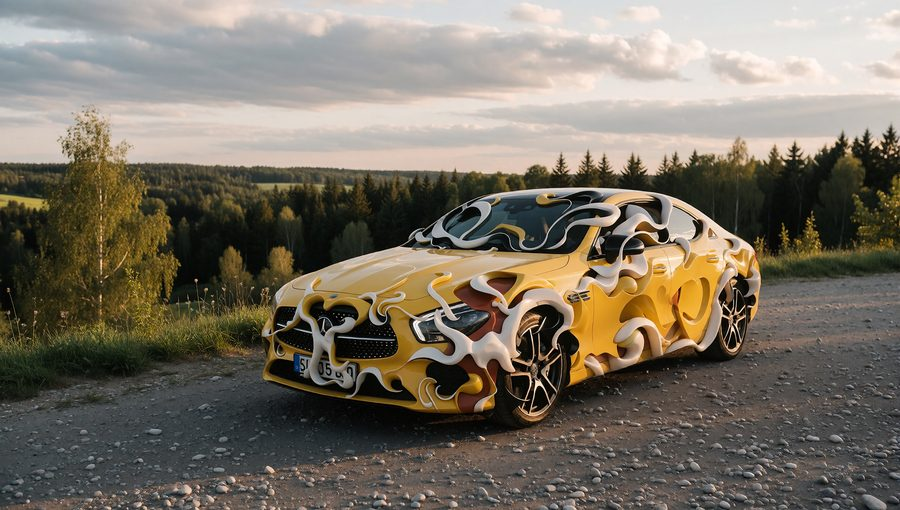</a></td>
<td width="33%"><a href="docs/images/glitch-18.jpg"></a></td>
<td width="33%"><a href="docs/images/glitch-19.jpg"></a></td>
</tr>
<tr>
<td width="33%"><a href="docs/images/glitch-20.jpg">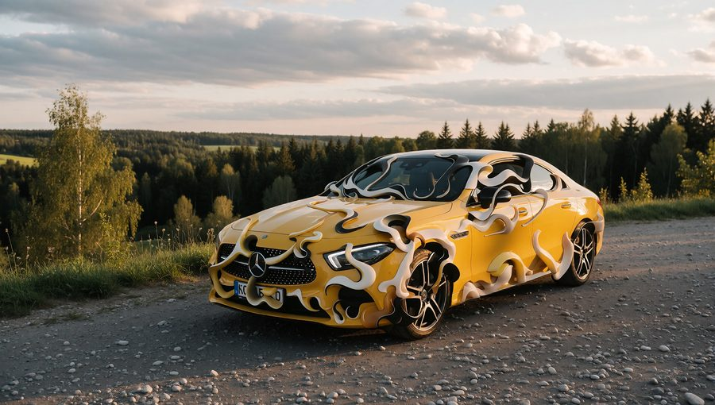</a></td>
<td width="33%"><a href="docs/images/glitch-21.jpg"></a></td>
<td width="33%"><a href="docs/images/glitch-22.jpg"></a></td>
</tr>
</table>

**`noise` · strength 60 · probability 0.025 · `spikes` blob 4 · steps 0–2**

<table>
<tr>
<td width="33%"><a href="docs/images/glitch-23.jpg">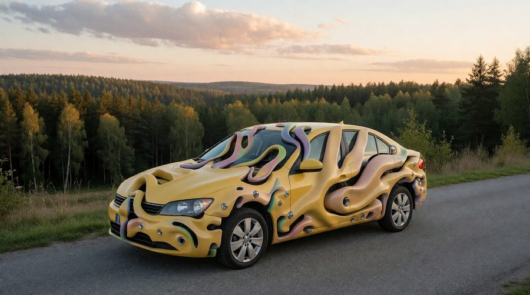</a></td>
<td width="33%"><a href="docs/images/glitch-25.jpg"></a></td>
<td width="33%"><a href="docs/images/glitch-24.jpg"></a></td>
</tr>
<tr>
<td width="33%"><a href="docs/images/glitch-26.jpg">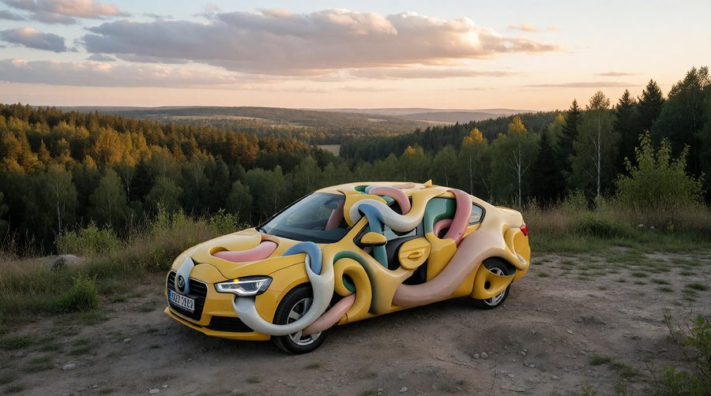</a></td>
<td width="33%"><a href="docs/images/glitch-27.jpg"></a></td>
<td width="33%"><a href="docs/images/glitch-28.jpg"></a></td>
</tr>
<tr>
<td width="33%"><a href="docs/images/glitch-29.jpg">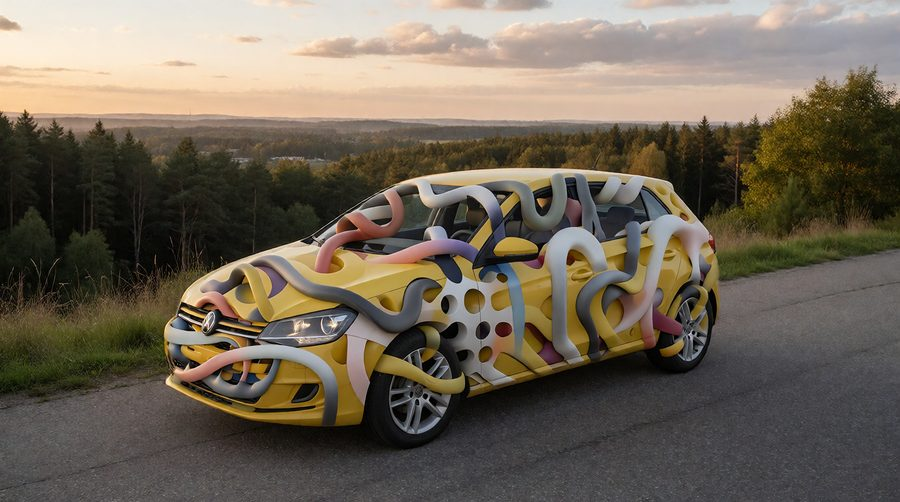</a></td>
<td width="33%"><a href="docs/images/glitch-30.jpg"></a></td>
<td width="33%"><a href="docs/images/glitch-31.jpg"></a></td>
</tr>
</table>

**`noise` · strength 60 · probability 0.025 · `gaussian` blob 1 · steps 0–2**

<table>
<tr>
<td width="33%"><a href="docs/images/glitch-32.jpg">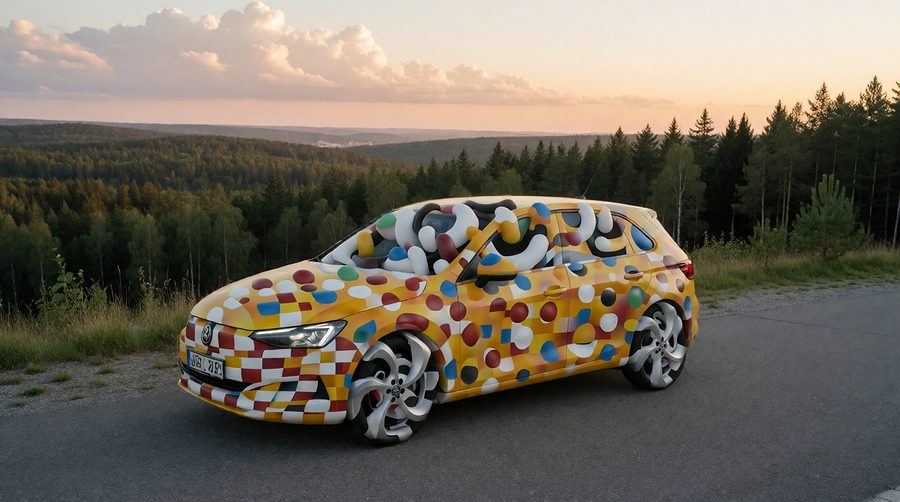</a></td>
<td width="33%"><a href="docs/images/glitch-34.jpg"></a></td>
<td width="33%"><a href="docs/images/glitch-33.jpg"></a></td>
</tr>
<tr>
<td width="33%"><a href="docs/images/glitch-35.jpg">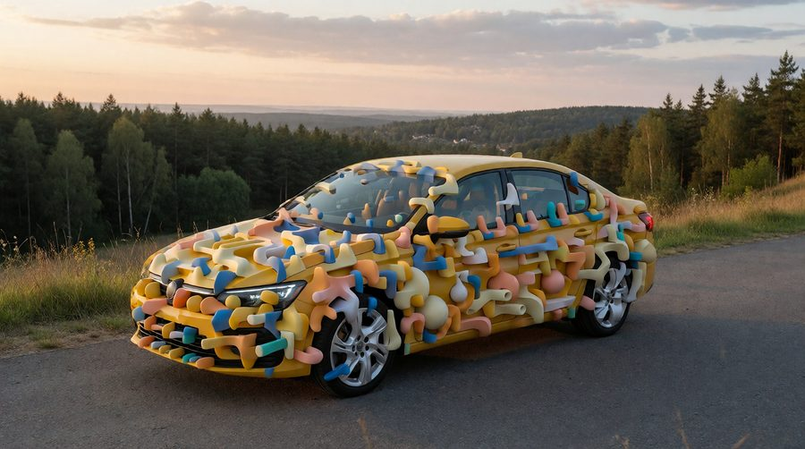</a></td>
<td width="33%"><a href="docs/images/glitch-36.jpg"></a></td>
<td width="33%"><a href="docs/images/glitch-37.jpg"></a></td>
</tr>
</table>

**`noise` · strength 60 · probability 0.025 · `spikes` blob 4 · steps 0–2**

<table>
<tr>
<td width="33%"><a href="docs/images/glitch-38.jpg">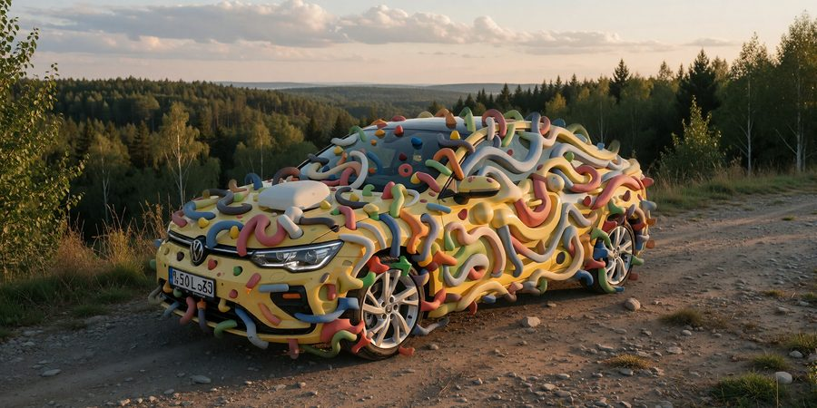</a></td>
<td width="33%"><a href="docs/images/glitch-39.jpg"></a></td>
<td width="33%"><a href="docs/images/glitch-40.jpg">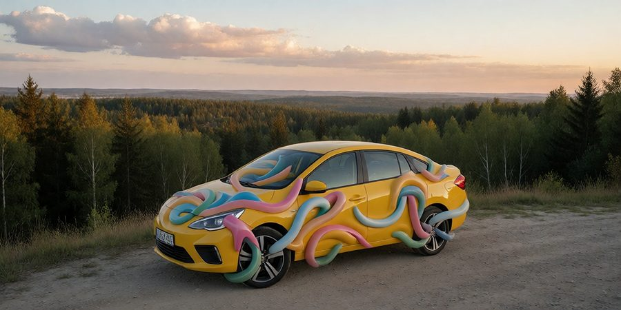</a></td>
</tr>
<tr>
<td width="33%"><a href="docs/images/glitch-41.jpg">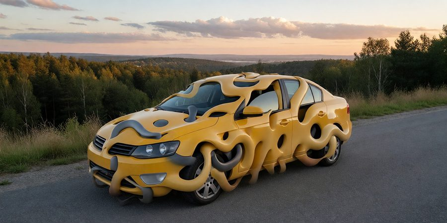</a></td>
<td width="33%"><a href="docs/images/glitch-42.jpg"></a></td>
<td width="33%"><a href="docs/images/glitch-43.jpg"></a></td>
</tr>
<tr>
<td width="33%"><a href="docs/images/glitch-44.jpg">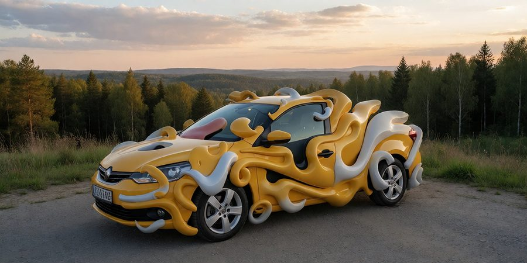</a></td>
<td width="33%"><a href="docs/images/glitch-45.jpg">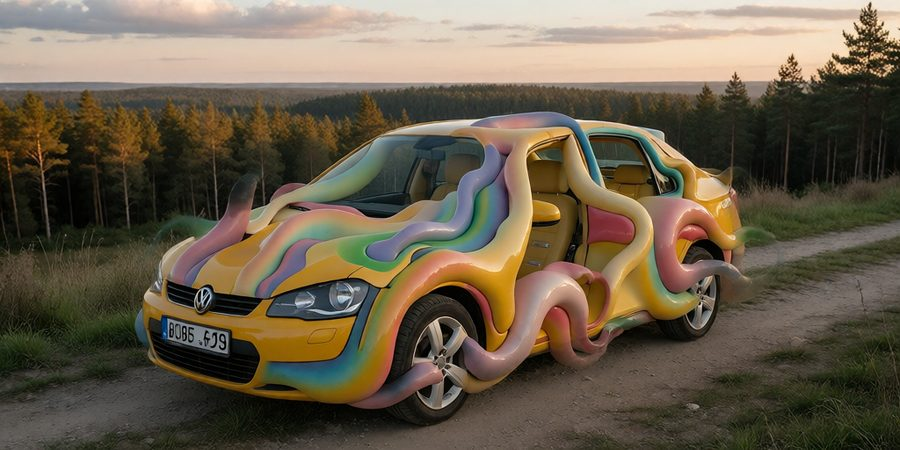</a></td>
<td width="33%"><a href="docs/images/glitch-46.jpg">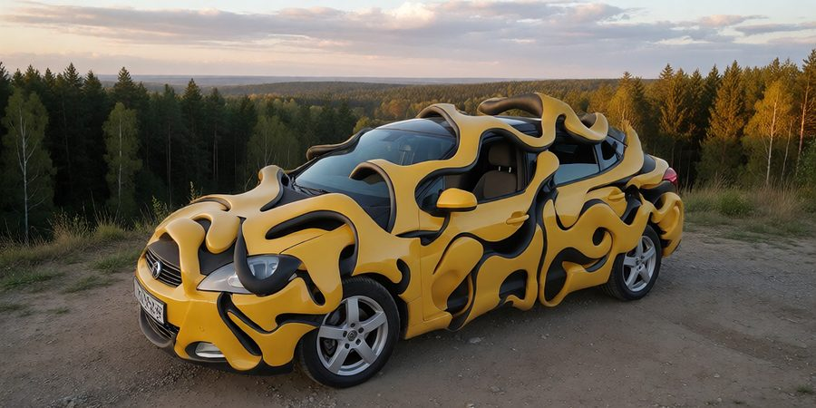</a></td>
</tr>
<tr>
<td width="33%"><a href="docs/images/glitch-47.jpg">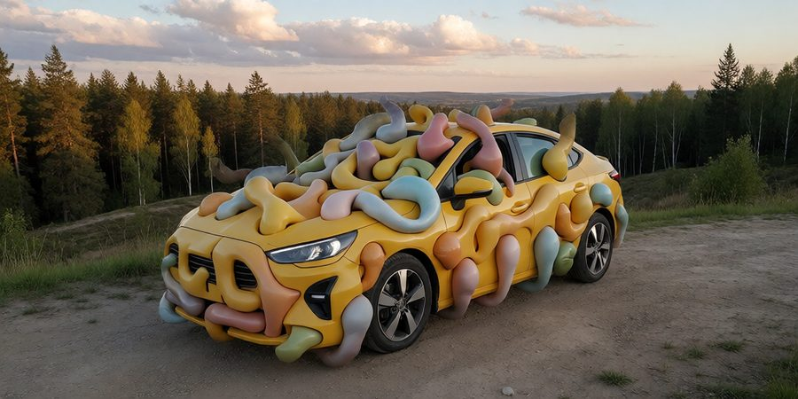</a></td>
<td width="33%"><a href="docs/images/glitch-48.jpg"></a></td>
<td width="33%"><a href="docs/images/glitch-49.jpg">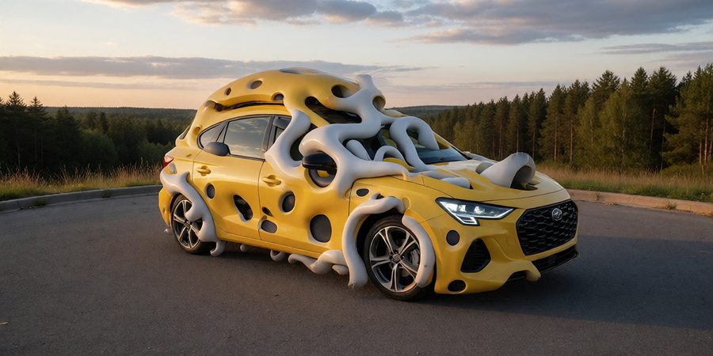</a></td>
</tr>
<tr>
<td width="33%"><a href="docs/images/glitch-50.jpg">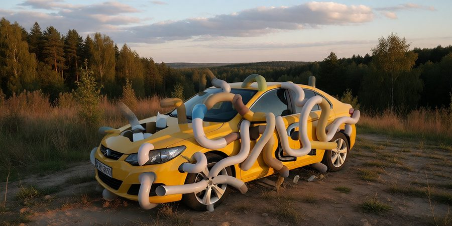</a></td>
<td width="33%"><a href="docs/images/glitch-51.jpg">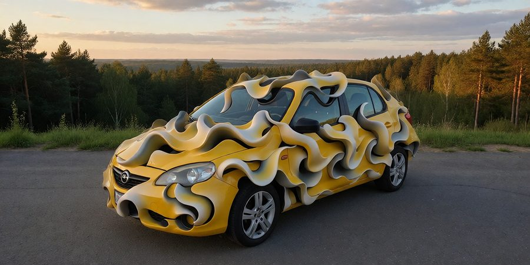</a></td>
<td width="33%"></td>
</tr>
</table>
